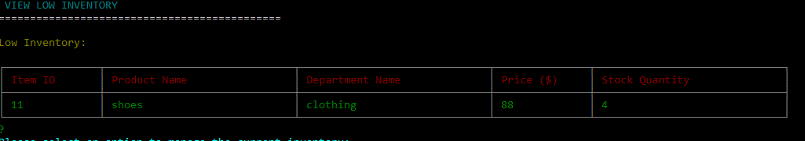

# BAMAZON
This is a CLI application that uses MYSQL database and inquirer npm packages for data input and storage and coded using node.js. It has customer, manager and supervisor options for buying, adding and managing inventories. It is an Amazon-like storefront that takes in orders from customers and depletes stock from the store's inventory. It also tracks product sales across the store's departments and provides a summary of the highest-grossing departments in the store.

## CUSTOMER
To access this option, type in `node.bamazonCust.js` into the command line.

An id to assigned to the customer and the products available for sale are displayed. Th customer is prompted to enter an item id of the products to purchase. This is located on the first column of the table.

The customer is prompted to enter the quantity ofthe items to be purchased. This is added to the cart and the order total is calculated. 

## MANAGER 
To access this option, type in `node.bamazonMgr.js` into the command line.

The manager has four options to select. View products, view low inventory, add to inventory and add new product.

If the 'view products for sale' option is selected, the inventory is displayed.

If the 'low inventory' option is selected, the products that are five or less will be displayed.

If the 'add to inventory' option is selected, the Manager is prompted to enter the item id of the products and the quantity to be updated. The inventory will be updated.

If the 'add new product' option is selected, the Manager is prompted to add the name, department name, price, quantity of the product. The inventory will be updated e.g item id 11 (shoes).

## SUPERVISOR
To access this option, type in `node.bamazonSupv.js` into the command line.

The supervisor has two options to select. 'view product sales by department' and 'create new department'.

If the 'view products for sale' option is selected, the inventory is displayed by department. The overhead costs and product sales will also be displayed.

If the 'create new department' option is selected, the supervisor is prompted to enter the name and overhead costs of the new department. 